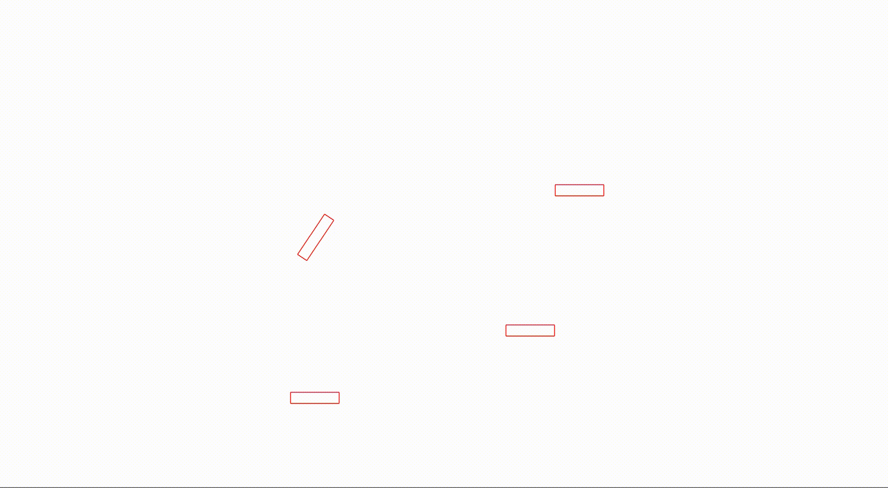
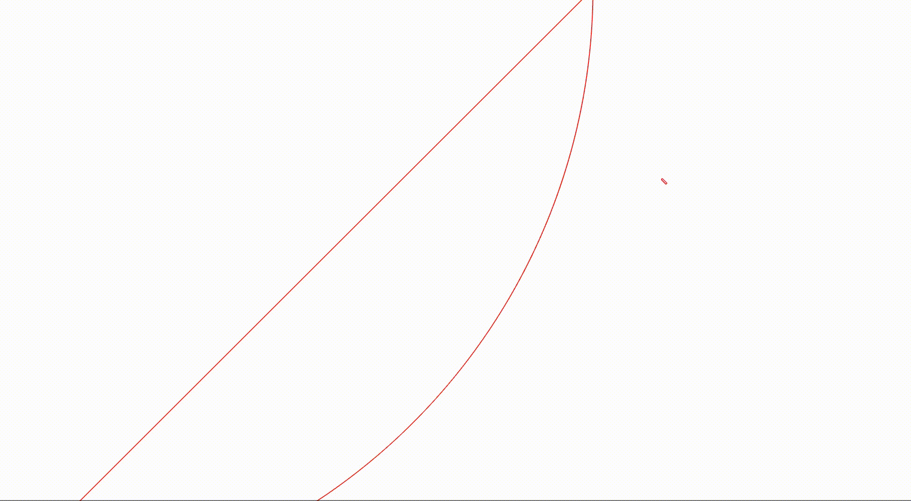
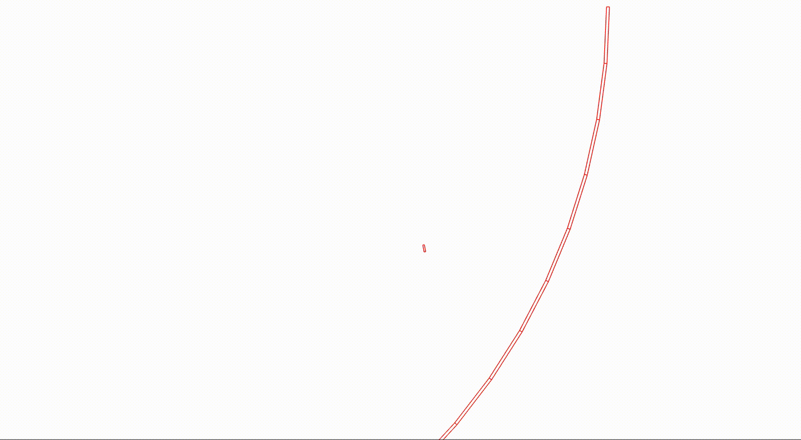

# HR Physics Simulation Engine

This is a very simple top-down 2D physics simulation that I implemented using Python. I plan to use it as part of my horse racing simulation and managing game. (No Rotation)


Currently, the world is set up as a top-down view.
The direction of gravity is pointing into the screen. (negative Z axis)
The current visualizing user interface is implemented using Pyglet.
However, the world and rigid body simulation are separated from the visual part of the project.
Therefore, in the future the visualizing part can be swapped out; I plan to use Pillow as the other visualizing alternative.
The simulation can also run lacking the visual part of it. 

There are a few things that I would like to clarify first.
- Horses are simulated as rectangles bearing similar dimensions as real horses to simplify the simulation.
- Inner Guard Rails are depicted as circular arcs, the entire turn would consist several different arcs each with different radius and center.
- Outer Guard Rails are similar to the inner ones. However, since they are concave shapes, collisions resolving cannot be calculated using SAP (separate axis theorem). Thus, they have to be broken apart into different little rectangles and as a whole they form the entire guard rail and that their collisions can be resolved using SAP.

Currently I have different Rigid Body Types and their respective counterpart to be rendered in pyglet. 

Below is the common attributes among the different rigid body types.
- Center: X, Y Coordinate of the center of the rigid body. The vertices of the rigid body are calculated relative to the center. The orientation angle (rotation) of the body is rotated around this point as well. 
- Orientation Angle: The rotation of the rigid body in radians. CCW (Counter Clock Wise) is the positive direction. 0 radian is at the X-axis.

### Polygon
Convex shape that has 3 sides or more.
### Rectangle
Quad with two pairs of sides.
### Circle
Full Circle
### Fan 
Arc with two straight sides connecting the center to the start and end of the arc.
### Crescent
This is a shape that I named for my inner guard rails. 
### Fence
This is a shape that I named for my outer guard rails.

## Collisions
- Horse With each other. (These aren't very realistic yet it's a work in progress)


- Horse With Inner Guard Rails.


- Horse With the Outer Guard Rails.



## Documentation WIP
If you want to try this out just install the dependency using the requirement.txt like this. Make sure you are using python 3.
```
pip install -r /path/to/requirements.txt
```
and run the example using 
```
 python3 -m hracing.hrvisual.hrpyglet.test      
```

Feel free to check out the test example. I know it's still kind of rough. So I plan to organize the project in the future along the development of my larger project which is the entire horse racing simulation game. Stay tuned?
